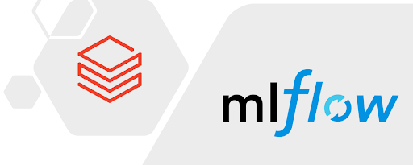

# MLflow LLM fine-tuning with synthetic data



Training demo for Databricks + MLflow with LLama 3.0 LLM.

1. Load PDFs - European Financial Regulation PDFs: parse + split the PDF data and save to a Delta table `splitted_documents`
2. Generate good quality Q&A data about Capital Requirements Regulation using Chain-of-Thought reasoning.  Write the training and validation data to Delta tables: `qa_dataset_train`, `qa_dataset_val`
3. Fine-tune a Llama 3.0 8B model on the generated synthetic dataset from step 2.  Source the LLM model from the available [Databricks Foundation Models](https://docs.databricks.com/en/machine-learning/foundation-models/index.html) 
4. Evaluate the model against the eval dataset.  

### Details

In **Notebook 1** we prepare some raw data by reading in PDF files from the ./data/ folder and creating the `splitted_documents` table data source.
  
In **Notebook 2** the function `build_instruction_eval_dataset()` generates an evaluation dataset containing Question, Answer and Context records using supplied LLM
This function links multiple prompt templates into a Langchain chain which applies an LLM to the input Spark dataframe.

The training and validation data-set has a single column, `messages` with a nested format for each row:
```
0: {"content": "You are a Regulatory Reporting Assistant.
Please answer the question as precise as possible using information in context.
If you do not know, just say I don't know. ", 
   "role": "system"
} 

1: 
{"content": "Context:
     ... <context here> ...
Please answer the user question using the given context:

<question here>",
   "role": "user"   
 }

2: 
{"content": "<answer for training with>",
   "role": "assistant"
}        

```
  
In **Notebook 3**, Synthetic training data generated in Notebook 2 is used to fine-tune a Llama 3 8B model for a specific task.  

In **Notebook4**, We evaluate the model we have fine-tuned during the previous step using Llama 3.1 405b-instruct.   


## Setup Notes

This Demo relies upon [Unity Catalog](https://docs.databricks.com/en/data-governance/unity-catalog/index.html) with [Serverless Compute](https://docs.databricks.com/en/compute/serverless/index.html).  

Databricks charges for fine-tuning LLMs are listed [here](https://www.databricks.com/product/pricing/mosaic-foundation-model-training)

Check the [regional availability](https://docs.databricks.com/en/resources/feature-region-support.html) for Model Training.

### Data Staging

The source PDFs (located in the `data` folder of this Repo) need to be staged in a Unity Catalog volume:   
`/<catalog>/<schema>/data`

### Acnowledgments

This example was cloned and then extended from an example created by [mstelma](https://github.com/mshtelma) - [techsummit25-model-adaptation-lab](https://github.com/mshtelma/techsummit25-model-adaptation-lab)
 
